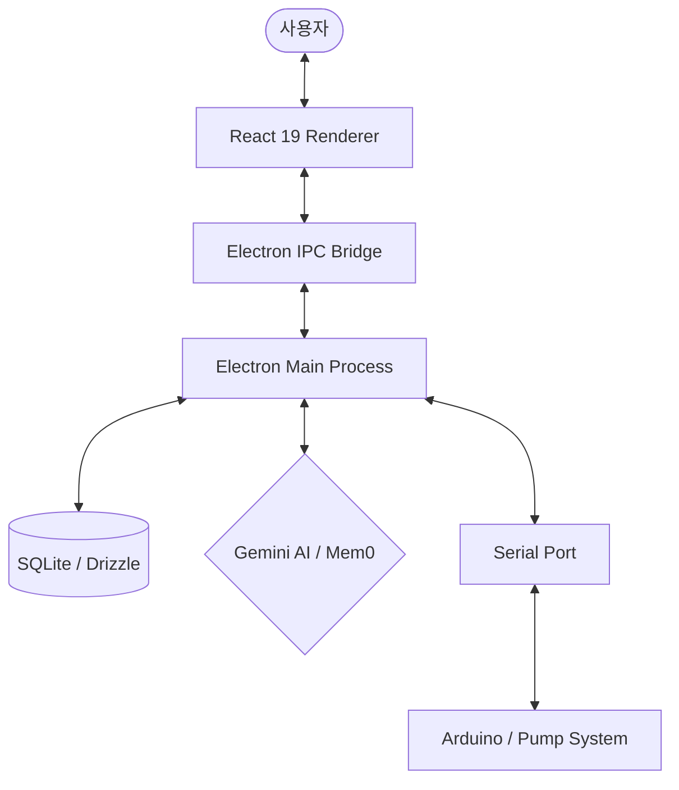

# Pump GUI - Smart Pump Control & Monitoring System


**Pump GUI**는 아두이노와 연결된 펌프 시스템을 실시간으로 제어하고, 센서 데이터를 모니터링 및 분석할 수 있는 Electron 기반 데스크톱 애플리케이션입니다. 데이터 시각화와 AI 어시스턴트 기능을 통합하여 실험실이나 산업 현장에서의 사용자 편의성을 극대화하였습니다.

---

## 🚀 주요 기능 (Key Features)

### 1. 실시간 펌프 제어 및 모니터링
- **Serial Communication:** 아두이노와의 고속 시리얼 통신을 통한 펌프 모터 제어.
- **Custom Packet Protocol:** 체크섬(Checksum) 검증을 포함한 안정적인 바이너리 데이터 패킷 설계.
- **Multi-Motor Support:** 독립적인 다중 모터 채널 제어 및 상태 모니터링.

### 2. 데이터 로깅 및 시각화
- **Automated Logging:** 펌프 사용량 및 센서 데이터를 SQLite(Drizzle ORM)에 실시간 자동 저장.
- **Interactive Dashboard:** Recharts를 활용하여 주별/월별 사용량을 막대, 선, 영역형 차트로 시각화.
- **Usage History:** 데이터베이스에 축적된 과거 이력 조회 기능.

### 3. AI 기반 스마트 어시스턴트
- **Gemini AI Integration:** Google Gemini API를 활용하여 시스템 데이터 분석 및 가이드 제공.
- **Contextual Memory:** Mem0를 사용하여 사용자 대화 컨텍스트를 기억하고 최적화된 답변 제공.
- **Streaming Response:** 실시간 스트리밍 방식으로 자연스러운 AI 대화 경험.

### 4. 사용자 편의 기능
- **Auto-Update:** Electron-Updater를 통한 최신 버전 자동 업데이트 및 배포 관리.
- **Responsive UI:** React 19와 Tailwind CSS 4, Radix UI를 사용한 세련되고 직관적인 디자인.
- **Settings Management:** API 키 및 시리얼 포트 설정을 로컬 환경에 안전하게 저장.

---

## 🛠 기술 스택 (Tech Stack)

### Frontend
- **Framework:** React 19 (TypeScript)
- **Styling:** Tailwind CSS 4, Radix UI
- **Icons:** Lucide React
- **Visualization:** Recharts
- **Router:** React Router DOM v7

### Desktop & Backend (Main Process)
- **Runtime:** Electron 39
- **Hardware Interaction:** SerialPort (Node-Serialport)
- **Database:** SQLite (better-sqlite3)
- **ORM:** Drizzle ORM
- **AI/ML:** Google Generative AI SDK, Mem0

### Build & Dev Tools
- **Bundler:** Vite
- **Packaging:** Electron Builder
- **Automation:** GitHub Actions (for Publishing)

---

## 🏗 시스템 아키텍처 (Architecture)



1. **Renderer Process:** 사용자 인터페이스 및 데이터 시각화를 담당하며, IPC를 통해 Main 프로세스와 통신합니다.
2. **Main Process:** 하드웨어(SerialPort) 제어, 데이터베이스 접근, AI API 통신 등 백엔드 로직을 처리합니다.
3. **Hardware:** 아두이노가 실제 펌프를 구동하며 센서 데이터를 10바이트 바이너리 패킷으로 응답합니다.

---

## 📦 1. 필수 빌드 도구 설치 (Prerequisites)

Windows 환경에서 네이티브 모듈(better-sqlite3, serialport) 빌드를 위해 **Python**과 **Visual Studio C++ Build Tools**가 필요합니다.
PowerShell을 **관리자 권한**으로 실행한 후 아래 명령어를 입력하세요.

### 권장 환경
- **Node.js:** v22.21.1

```powershell
# Chocolatey를 이용한 설치 (권장)
choco install python visualstudio2022-workload-vctools -y
```

### 환경 변수 설정
`.env` 파일을 루트 디렉토리에 생성하고 GitHub Classic Token을 입력하세요 (배포 권한 필요).
```env
GH_TOKEN=<여기에_토큰을_입력하세요>
```

---

## 🐛 2. 트러블슈팅 (Windows 11)

### `better-sqlite3` 빌드 오류 수정
Windows 11 환경에서 `better-sqlite3` 빌드 시 V8 Isolate 관련 오류가 발생한다면, 아래와 같이 소스 코드를 패치해야 합니다.

* **관련 이슈**: [GitHub Issue #1401](https://github.com/WiseLibs/better-sqlite3/issues/1401) 
* **대상 파일**: `node_modules/better-sqlite3/src/better_sqlite3.cpp`

**수정 전 (Original):**
```cpp
NODE_MODULE_INIT(/* exports, context */) {
    v8::Isolate* isolate = context->GetIsolate(); 
    // ...
}
```

**수정 후 (Fixed):**
```cpp
NODE_MODULE_INIT(/* exports, context */) {
    // v8::Isolate* isolate = context->GetIsolate();
    v8::Isolate* isolate = v8::Isolate::GetCurrent(); // 이 코드로 변경
    // ...
}
```

---

## 🔑 3. 설정 및 API 키 저장

애플리케이션 설정 및 API 키(Google Gemini, Mem0)는 다음 경로에 `settings.json` 형태로 저장됩니다.
- **경로:** `C:\Users\<사용자계정>\AppData\Roaming\pump-gui\settings.json`

프로그램 내 **Settings** 메뉴를 통해 간편하게 설정할 수 있습니다.

---

## 📥 설치 및 실행 (Development)

1. 의존성 설치:
   ```bash
   npm install
   ```
2. 네이티브 모듈 빌드:
   ```bash
   npm run rebuild
   ```
3. DB 스키마 동기화:
   ```bash
   npm run db:push
   ```
4. 개발 모드 실행:
   ```bash
   npm run dev
   ```

---

## 📄 라이선스 (License)
본 프로젝트는 개인 포트폴리오 및 아두이노 팀 프로젝트용으로 개발되었습니다.
